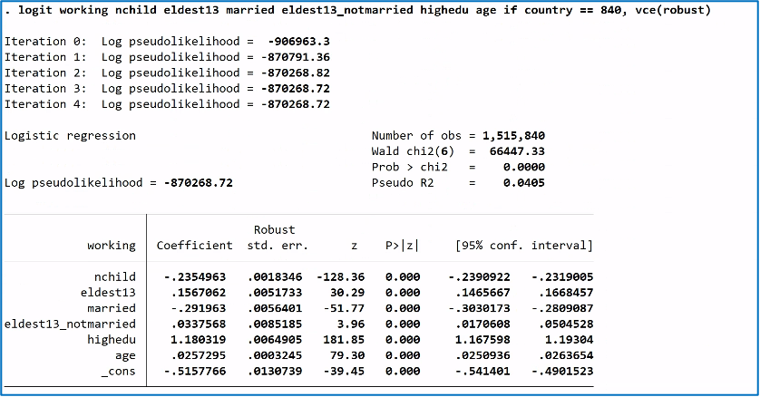
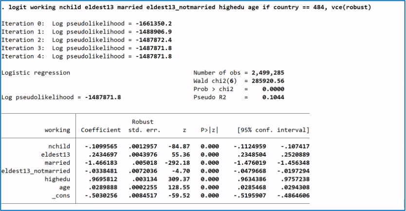

# Maternal Labor Force Participation: United States vs Mexico
**Question:** How do family structure and child characteristics influence maternal labor force participation in the United States and Mexico?

**Method:** Logistic regression

**Data:** 2020 IPUMS International census microdata

**Tools:** Stata, econometric modeling

## Overview

This project examines how family structure and child characteristics influence maternal labor force participation in the United States and Mexico.

Using 2020 IPUMS census microdata, I estimate logistic regression models to examine how fertility, child age, marital status, and education affect the likelihood that mothers participate in the labor force.

The goal is to compare how similar household factors shape employment decisions across two different national contexts.
## Research Question

How do fertility, child age, marital status, and education influence maternal labor force participation in the United States and Mexico?
## Dataset

The analysis uses 2020 census microdata from **IPUMS International**.

Sample restrictions:
- Women ages 18–50
- Mexico: 2,499,285 observations
- United States: 1,515,840 observations
## Methods

Separate logistic regression models were estimated for the United States and Mexico.

Dependent variable:
- Employment status (binary)

Independent variables:
- Number of children
- Eldest child age ≥ 13
- Marital status
- Interaction: unmarried × eldest child ≥13
- Higher education
- Age

All data cleaning, variable recoding, and model estimation were conducted in **Stata**.
## Model Results

The following logistic regression models estimate the probability that mothers participate in the labor force based on family structure, education, and age.

### United States

### Mexico

## Key Findings

- Each additional child reduces the probability that a mother participates in the labor force.

- The negative effect of additional children is **stronger in the United States** than in Mexico.

- Having an eldest child age 13 or older is associated with a higher likelihood of employment in both countries.

- Higher education strongly increases employment likelihood in both models.

- The interaction between marital status and older children differs across countries, suggesting that household structure shapes employment decisions differently in the United States and Mexico.

## Skills Demonstrated

- Logistic regression modeling
- Econometric analysis
- Large-scale microdata analysis 
- Data cleaning and variable recoding
- Cross-country statistical comparison
- Stata programming

## Repository Contents

[**code/**](https://github.com/natalie-ava/maternal-employment-analysis/tree/main/code)

Stata script containing all data transformations and regression models.

[**docs/**](https://github.com/natalie-ava/maternal-employment-analysis/tree/main/docs)

Full research paper and presentation slides.

[**outputs/**](https://github.com/natalie-ava/maternal-employment-analysis/tree/main/outputs)

Regression results and figures.

## Note

The original IPUMS dataset is not included in this repository due to licensing restrictions.  
To reproduce the analysis, users must download the dataset from IPUMS and update the file path in the `.do` file.
